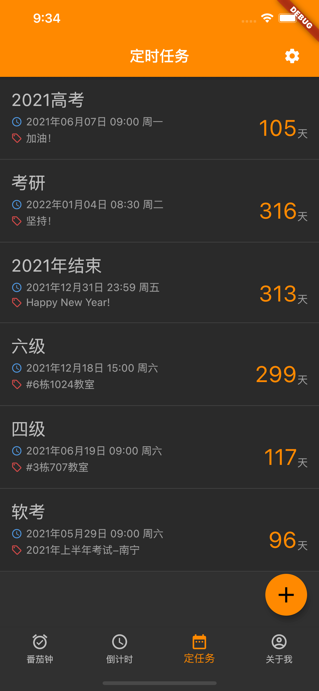
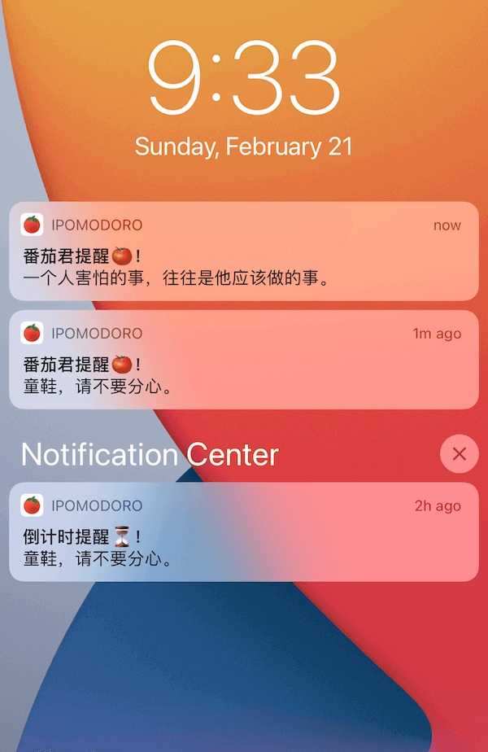

# iPomodoro-Flutter

iPomodoro(爱番茄)。🍅 番茄工作法是一种时间管理法方法，在上世纪八十年代由Francesco Cirillo创立。 该方法使用一个定时器来分割出一个一般为25分钟的工作时间和5分钟的休息时间，而那些时间段被称为pomodori，为意大利语单词pomodoro之复数。

## iPomodoro(爱番茄🍅)
爱番茄是一个简单和有效的番茄工作法的应用，灵感来自 iOS app `我要当学霸` 和 macOS app `Promodoro Timer`，这2个App已经下架多年了，所以，想以此为基础，开发Android/iOS/macOS版本，并且开源，所有平台暂定免费下载，计划内置打赏机制，iOS/macOS版本不定时收费1人民币(苹果开发账号费)。

## 简介

- 分心？❌
- 拖延？❌
- 高效？✅
- 专注？✅

iPomodoro(爱番茄)

【功能简介】
番茄时间管理和学习规划，妈妈再也不用担心我的学习啦！不再分心！不再拖延！高效！专注！，让大家在学习时可以更加专注也可以快速和简单的学习get!

【三大特点】
1、番茄学习模式，使用番茄工作法学习，让你劳逸结合！
2、计时学习模式，按照设定的时长学习，想学多久就学多久！
3、定时任务模式，倒数日、任务记录，每日学习任务！

杜绝学习没有目标！满足你对学习的求知欲望！

**番茄学习**
- 使用番茄工作法学习

**计时学习**
- 按照设定的时长学习

请不要
放弃治疗！
好好学习
你还有救！

### 下载&安装

1、商店安装

| 已上架的商店 | 下载地址 |
|---|---|
| 苹果商店  | [https://apps.apple.com/cn/app/ipomodoro/id1439666929](https://apps.apple.com/cn/app/ipomodoro/id1439666929)  |
| 谷歌商店 | [https://play.google.com/store/apps/details?id=com.iHTCboy.iPomodoro](https://play.google.com/store/apps/details?id=com.iHTCboy.iPomodoro) |
| 华为商店 | [https://appgallery.huawei.com/#/app/C103911977](https://appgallery.huawei.com/#/app/C103911977) |
| 小米商店 | [http://app.xiaomi.com/detail/1341005](http://app.xiaomi.com/detail/1341005) |
| 酷安商店 | [https://www.coolapk.com/apk/282769](https://www.coolapk.com/apk/282769) |

> 注：因为苹果开发者账号需要 ￥688 年费，所以 AppStore下载收费1元。介意的朋友可以下载本项目代码在macOS系统编译安装。

2、编译安装
iOS app 因为苹果开发者账号需要 ￥688 年费，所以 AppStore 为付费下载，请见谅。你可以下载本项目代码在macOS系统编译安装。

### 应用截图

